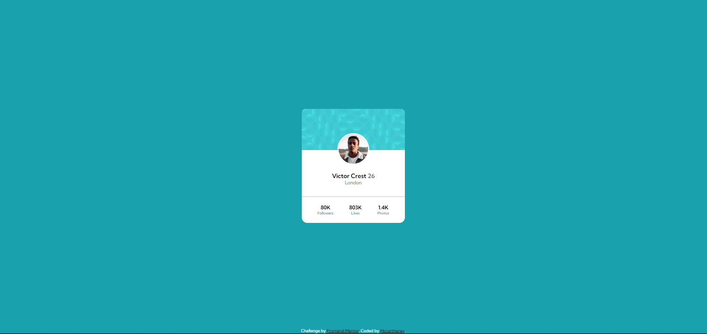
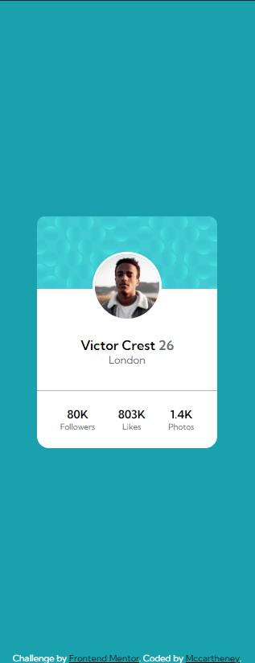

## Table of contents

- [Overview](#overview)
  - [The challenge](#the-challenge)
  - [Screenshot](#screenshot)
  - [Links](#links)
- [My process](#my-process)
  - [Built with](#built-with)
  - [What I learned](#what-i-learned)
- [Author](#author)

## Overview

### The challenge

- Build out the project to the designs provided

### Screenshot

### Links

- Solution URL: [Solution URL](https://github.com/mccartheney/Profile-card-component)
- Live Site URL: [Site URL](https://vocal-boba-1a3575.netlify.app/)

## My process

### Built with

- Semantic HTML5 markup
- CSS custom properties
- Flexbox
- Mobile-first workflow

## Author

- linkedIn - [Mccartheney Mendes](https://www.linkedin.com/in/mccartheney-mendes-892709292/)
- github - [Mccartheney Mendes](https://github.com/mccartheney)
- Frontend Mentor - [@mccartheney](https://www.frontendmentor.io/profile/mccartheney)